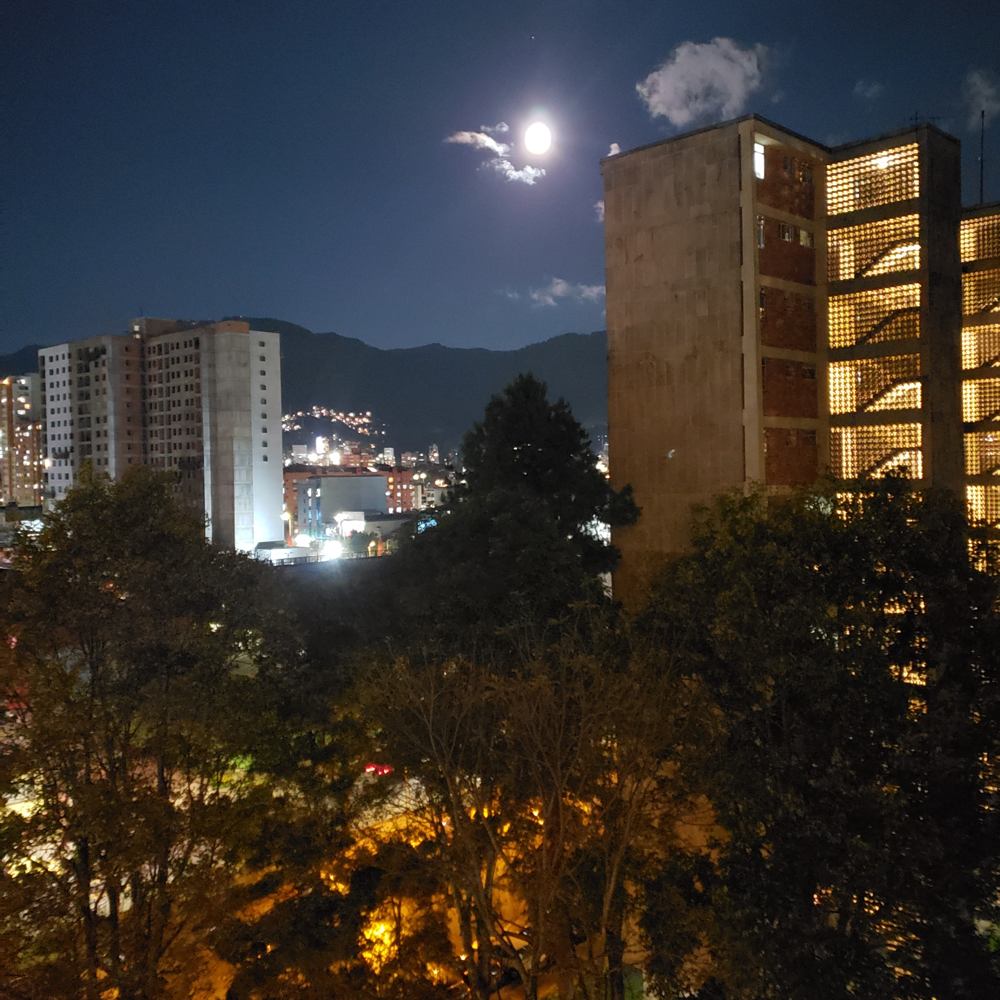
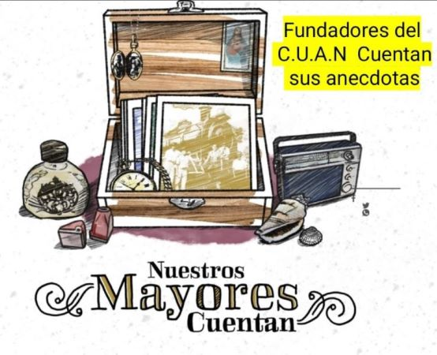
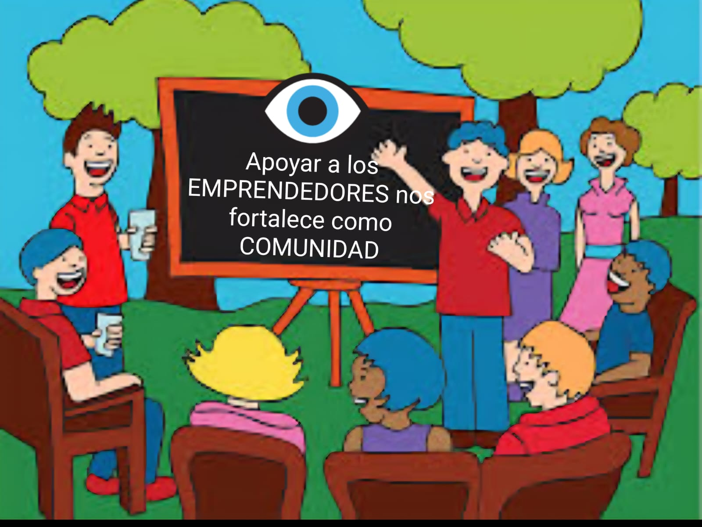
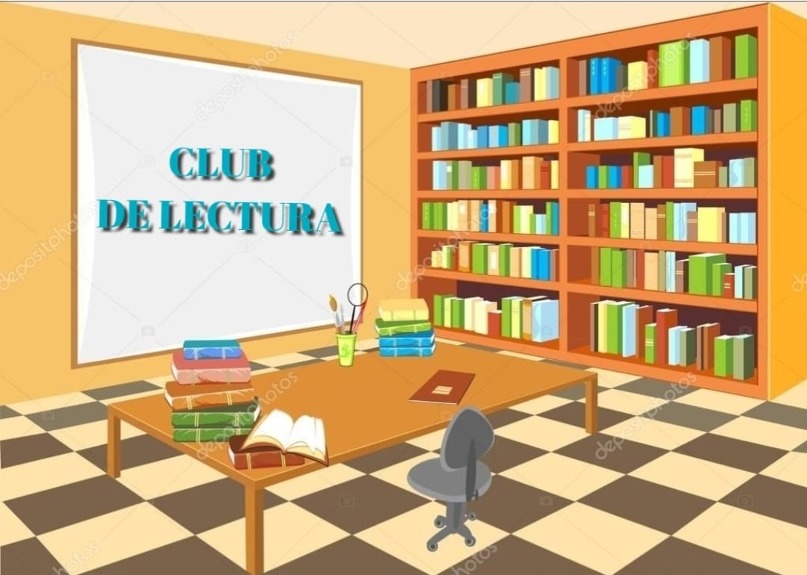
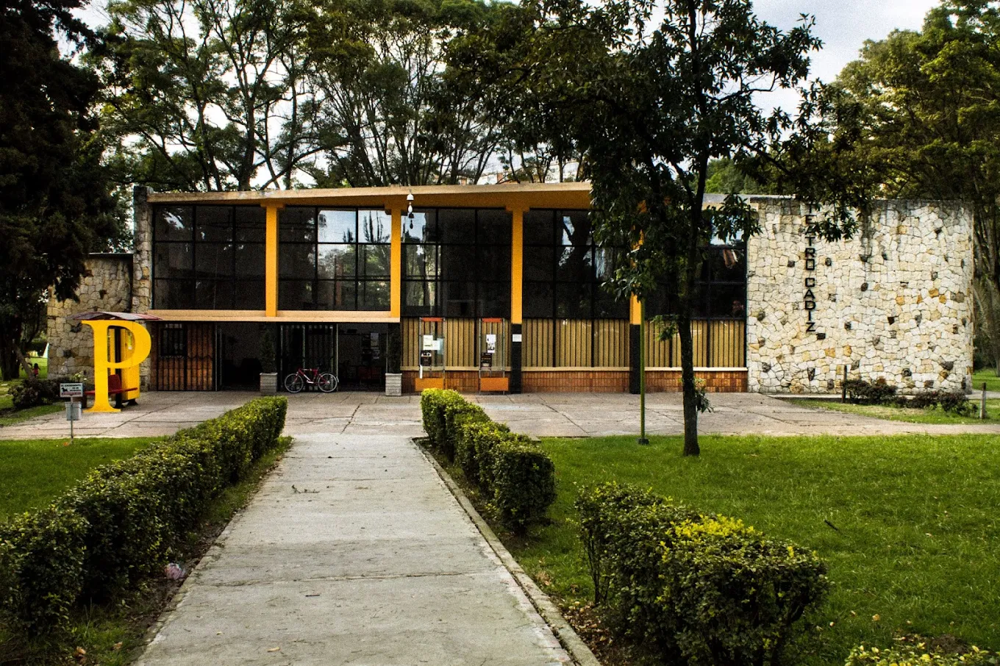

<!DOCTYPE html>
<html lang="es">
<head>
    <meta charset="UTF-8">
    <meta name="viewport" content="width=device-width,initial-scale=1.0">
    <title>La Voz del C.U.A.N - Comunidad Centro Urbano Antonio Nariño</title>
    
    <link href="https://fonts.googleapis.com/icon?family=Material+Icons" rel="stylesheet">
    
</head>
<body class="bg-gray-50 text-gray-800" style="overflow: auto;">
    <header class="bg-green-800 text-white shadow-lg">
        

            

                

                    
                    

                        <h1 class="text-xl md:text-2xl font-bold">LA VOZ DEL C.U.A.N</h1>
                        
Una comunidad sana es una comunidad sin secretos

                    

                

                <nav class="w-full md:w-auto">
                    <ul class="flex flex-wrap justify-center md:justify-end items-center space-x-1 md:space-x-2">
                        <li><a href="#inicio" class="px-3 py-2 rounded hover:bg-green-700 transition">Inicio</a></li>
                        <li><a href="#historia" class="px-3 py-2 rounded hover:bg-green-700 transition">Historia</a></li>
                        <li><a href="#noticias" class="px-3 py-2 rounded hover:bg-green-700 transition">Noticias</a></li>
                        <li><a href="#servicios" class="px-3 py-2 rounded hover:bg-green-700 transition">Servicios</a></li>
                        <li><a href="#naturaleza" class="px-3 py-2 rounded hover:bg-green-700 transition">Naturaleza</a></li>
                        <li><a href="#teatro" class="px-3 py-2 rounded hover:bg-green-700 transition">Teatro</a></li>
                        <li><a href="#contacto" class="px-3 py-2 rounded hover:bg-green-700 transition">Contacto</a></li>
                        <li><button id="loginBtn" class="ml-2 px-4 py-2 bg-yellow-500 text-gray-900 rounded-lg font-medium hover:bg-yellow-400 transition flex items-center">loginAcceso Residentes</button></li>
                    </ul>
                </nav>
            

        

    </header>

    <section id="inicio" class="hero-banner flex items-center justify-center text-white py-20 md:py-32">
        

            <h2 class="text-3xl md:text-5xl font-bold mb-4">Bienvenidos a nuestra comunidad</h2>
            
El Centro Urbano Antonio Nariño, un espacio de convivencia y armonía

            

                <a href="#historia" class="px-6 py-3 bg-green-600 hover:bg-green-700 rounded-lg font-medium transition">Conoce nuestra historia</a>
                <a href="#servicios" class="px-6 py-3 bg-yellow-500 hover:bg-yellow-600 text-gray-900 rounded-lg font-medium transition">Nosotros</a>
            

        

    </section>

    <section class="bg-gray-100 py-12">
        

            

                

                    apartment
                    <h3 class="text-3xl font-bold text-green-700">67</h3>
                    
Años de historia

                

                

                    groups
                    <h3 class="text-3xl font-bold text-green-700">3,000+</h3>
                    
Residentes

                

                

                    home
                    <h3 class="text-3xl font-bold text-green-700">864</h3>
                    
Apartamentos

                

                

                    park
                    <h3 class="text-3xl font-bold text-green-700">12</h3>
                    
Zonas verdes

                

            

        

    </section>

    <main class="container mx-auto px-4 py-12">
        <section id="historia" class="mb-16">
            

                

                    
                

                

                    <h2 class="text-3xl font-bold mb-6 text-green-800 flex items-center">historyNuestra Historia</h2>
                    

                        
El Centro Urbano Antonio Nariño (CUAN) es un conjunto residencial ubicado en la ciudad de Bogotá, Colombia. Se encuentra específicamente en la zona occidental del centro de la ciudad, en la localidad de Teusaquillo. Este conjunto es notable por su diseño y por su importancia histórica en el desarrollo urbano de Bogotá.

                    

                    <h3 class="text-2xl font-bold mb-4 text-green-700">Diseño y Construcción</h3>
                    

                        
El CUAN fue diseñado por los arquitectos Néstor C. Gutiérrez y la firma Esguerra Sáenz, Urdaneta, Suárez y Cía. Su construcción se inició a finales de la década de 1940, y fue inaugurado en 1952. El diseño del conjunto se caracteriza por su estilo moderno y funcional, con un uso eficiente de los materiales de construcción.

                        
El conjunto está compuesto por 14 edificios de apartamentos, de los cuales ocho tienen 13 pisos de altura, y seis tienen cuatro pisos. En total, el Centro Urbano Antonio Nariño alberga 960 apartamentos, con capacidad para unas 6,400 personas. Además de las residencias, el conjunto también incluye una escuela primaria, un colegio de bachillerato, una iglesia, un teatro y un supermercado, lo que lo convierte en una comunidad autosuficiente.

                    

                    <h3 class="text-2xl font-bold mb-4 text-green-700">Significado Histórico</h3>
                    

                        
El Centro Urbano Antonio Nariño es considerado un hito importante en la historia de la arquitectura y el desarrollo urbano de Bogotá. Fue uno de los primeros conjuntos residenciales de gran escala en la ciudad, y su diseño sirvió como modelo para muchos otros proyectos de vivienda que se construyeron posteriormente.

                        
El CUAN representó un nuevo enfoque en la planificación urbana, buscando crear comunidades integrales que ofrecieran a sus residentes no solo vivienda, sino también acceso a servicios esenciales y espacios recreativos.

                    

                    

                        
En reconocimiento a su valor arquitectónico e histórico, el Centro Urbano Antonio Nariño fue declarado Monumento Nacional de Colombia.

                    

                    <h3 class="text-2xl font-bold mb-4 text-green-700">Ubicación</h3>
                    

                        
El conjunto está ubicado en la Calle 25 con Carrera 37, en la localidad de Teusaquillo, una zona tradicional y de gran importancia en Bogotá. Su ubicación céntrica facilita el acceso a otras partes de la ciudad y a una amplia gama de servicios y comodidades.

                    

                    

                        
Hoy en día, el Centro Urbano Antonio Nariño sigue siendo un lugar de residencia importante en Bogotá, y su legado perdura como un ejemplo destacado de la arquitectura moderna y la planificación urbana en Colombia.

                    

                

            

        </section>

        <section id="servicios" class="mb-16">
            <h2 class="text-3xl font-bold mb-8 text-green-800 text-center">miscellaneous_servicesNOSOTROS</h2>
            

                
                <!-- Iglesia Católica Modificada -->
                

                    

                        
                    

                    
                    

                        <h3 class="text-xl font-bold mb-2 text-green-700">Iglesia Católica</h3>
                        
Parroquia Cosmes y Damián

                        
                        

                            <h4 class="font-semibold text-gray-800 mb-2 flex items-center">
                                schedule
                                Horarios de Misa
                            </h4>
                            <ul class="text-sm text-gray-700 space-y-1">
                                <li class="flex justify-between">
                                    Domingos:
                                    7:00 am, 9:00 am, 11:00 am, 6:00 pm
                                </li>
                                <li class="flex justify-between">
                                    Lunes a Viernes:
                                    7:00 am, 12:00 m, 6:00 pm
                                </li>
                                <li class="flex justify-between">
                                    Sábados:
                                    7:00 am, 6:00 pm (Vísperas)
                                </li>
                            </ul>
                        

                        
                        

                            <h4 class="font-semibold text-gray-800 mb-2 flex items-center">
                                healing
                                Horarios de Confesiones
                            </h4>
                            <ul class="text-sm text-gray-700 space-y-1">
                                <li class="flex justify-between">
                                    Martes y Jueves:
                                    4:00 pm - 6:00 pm
                                </li>
                                <li class="flex justify-between">
                                    Sábados:
                                    9:00 am - 11:00 am
                                </li>
                            </ul>
                        

                        
                        <button onclick="openVideoModal('VIDEO_ID_IGLESIA')" class="w-full mt-3 px-4 py-2 bg-red-600 hover:bg-red-700 text-white rounded-lg flex items-center justify-center">
                            live_tv
                         Misa a Cualquier Hora
                        </button>
                    

                

                
                <!-- Supermercado cambiado a Ejercicios y Fitness -->
                

                    
                    

                        <h3 class="text-xl font-bold mb-2 text-green-700">Ejercicios y Fitness</h3>
                        
ESTIRAMIENTO YOGA FUERZA CHIKUNG

                        

                            scheduleHorario: A Cualquier Hora
                            <button onclick="openVideoModal('srvrIN3dnXE')" class="w-full mt-3 px-4 py-2 bg-red-600 hover:bg-red-700 text-white rounded-lg flex items-center justify-center">
                            live_tv
                    </button>
                         

                    

                

             

                    
                    

                        <h3 class="text-xl font-bold mb-2 text-green-700">PODCASTS CULTURA ARTE CINE </h3>
                        

                        

                            scheduleHorario:A Cualquier Hora
                            <button onclick="openVideoModal('Wx7BJFaQecA')" class="w-full mt-3 px-4 py-2 bg-red-600 hover:bg-red-700 text-white rounded-lg flex items-center justify-center">
                            live_tv
                        </button>
                        

                    

                

                

                    
                    

                        <h3 class="text-xl font-bold mb-2 text-green-700">MEMORIAS ANECDOTAS Y VIVENCIAS</h3>
                        

                        

                            scheduleHorario:A Cualquier Hora
                        <button onclick="openVideoModal('7fz_87_ikH0')" class="w-full mt-3 px-4 py-2 bg-red-600 hover:bg-red-700 text-white rounded-lg flex items-center justify-center">
                            live_tv
                        </button>
                          

                    

                

                
                

                    
                    

                        <h3 class="text-xl font-bold mb-2 text-green-700">HOGAR Y BIENESTAR</h3>
                        
Bienestar

                        

                            scheduleHorario:A Cualquier Hora
                            <button onclick="openVideoModal('L5Tfja6mZDY')" class="w-full mt-3 px-4 py-2 bg-red-600 hover:bg-red-700 text-white rounded-lg flex items-center justify-center">
                            live_tv
                        </button>
                        

                    

                

                  

                    
                    

                        <h3 class="text-xl font-bold mb-2 text-green-700">Vecinos Apoyan Vecinos</h3>
                        
vecinos

                        

                            scheduleHorario: A Cualquier Hora
                            <button onclick="openVideoModal('jTOQTkGN-xs')" class="w-full mt-3 px-4 py-2 bg-red-600 hover:bg-red-700 text-white rounded-lg flex items-center justify-center">
                            live_tv
                        </button>
                        

                    

                

                

                    
                    

                        <h3 class="text-xl font-bold mb-2 text-green-700">RADIO NOVELAS Y AUDIOLIBROS</h3>
                        
vecinos

                        

                            scheduleHorario: A Cualquier Hora
                            <button onclick="openVideoModal('FdJ_6PSbToI')" class="w-full mt-3 px-4 py-2 bg-red-600 hover:bg-red-700 text-white rounded-lg flex items-center justify-center">
                            live_tv
                        </button>
                        <button onclick="openVideoModal('_0-if4ASuJw')" class="w-full mt-3 px-4 py-2 bg-red-600 hover:bg-red-700 text-white rounded-lg flex items-center justify-center">
                            live_tv
                        </button>
                        

                    

                

                
                

                    
                    

                        <h3 class="text-xl font-bold mb-2 text-green-700">Biblioteca Comunitaria y Club de Lectura</h3>
                        
Más de 1,000 títulos

                        

                            scheduleHorario: 10am - 6pm24 
                            <button onclick="openVideoModal('L6ZHNjsujJg')" class="w-full mt-3 px-4 py-2 bg-red-600 hover:bg-red-700 text-white rounded-lg flex items-center justify-center">
                            live_tv
                        </button>
                        
                       
                        

                    

                

            

        </section>

        <section id="naturaleza" class="mb-16 bg-green-50 rounded-xl p-8">
            

                

                    <h2 class="text-3xl font-bold mb-6 text-green-800 flex items-center">natureNuestra Naturaleza</h2>
                    
Contamos con una zona verde llena de árboles y naturaleza donde los pájaros de varias especies conviven con nosotros. Somos un pulmón para la ciudad de Bogotá.

                    
Nuestros jardines incluyen especies nativas como robles, cedros y arrayanes, que atraen colibríes, mirlas y otras aves que alegran nuestros días con su canto y colorido.Realmente es un privilegio poder vivir en el Centro Nariño PATRIMONIO DE LA NACION

                

                

                    
                

            

        </section>

        <section id="teatro" class="mb-16">
            

                

                    

                        
                    

                    

                        <h2 class="text-3xl font-bold mb-6 text-yellow-400 flex items-center">theater_comedyTeatro Cadiz</h2>
                        
Nuestro teatro comunitario con capacidad para 380 personas es un espacio cultural vibrante donde se presentan obras teatrales, conciertos y eventos comunitarios.

                        

                            <h3 class="text-xl font-bold mb-3 text-yellow-400">Próximos Eventos</h3>
                            <ul class="space-y-3">
                                <li class="flex items-start">eventpor anunciar</li>
                                <li class="flex items-start">eventpor anunciar</li>
                                <li class="flex items-start">eventpor anunciar</li>
                            </ul>
                        

                        <button class="px-6 py-3 bg-yellow-500 hover:bg-yellow-600 text-gray-900 rounded-lg font-medium transition flex items-center">
                            confirmation_numberReservar Entradas
                        </button>
                    

                

            

        </section>

        <section id="documentos" class="mb-16">
            <h2 class="text-3xl font-bold mb-6 text-green-800 text-center">descriptionDocumentos Importantes</h2>
            

                

                    

                        menu_book
                        

                            <h3 class="text-xl font-bold mb-2 text-green-700">Manual de Convivencia</h3>
                            
Normas y regulaciones para la armonía de nuestra comunidad.

                            <a href="#" class="text-green-600 hover:text-green-800 font-medium flex items-center">Descargar PDFdownload</a>
                        

                    

                

                

                    

                        gavel
                        

                            <h3 class="text-xl font-bold mb-2 text-green-700">Ley 675 de 2001</h3>
                            
Ley de Propiedad Horizontal de Colombia.

                            <a href="#" class="text-green-600 hover:text-green-800 font-medium flex items-center">Descargar PDFdownload</a>
                        

                    

                

            

        </section>
    </main>

    <footer id="contacto" class="bg-gray-900 text-white pt-12 pb-6">
        

            

                

                    <h4 class="text-xl font-bold mb-4 text-green-400 flex items-center">contact_mailContacto</h4>
                    <ul class="space-y-3">
                        <li class="flex items-start">phoneTeléfono: (601) 555-1234</li>
                        <li class="flex items-start">emailEmail: contacto@lavozdelcuan.com.co</li>
                        <li class="flex items-start">location_onDirección: Calle 25 # 35 39, Bogotá</li>
                    </ul>
                
 
                

                    <h4 class="text-xl font-bold mb-4 text-green-400 flex items-center">
                        linkEnlaces Rápidos
                    </h4>
                    <ul class="space-y-3">
                        <li>
                            <a href="https://drive.google.com/drive/folders/0ACjaNGromPRoUk9PVA" 
                               class="hover:text-green-400 transition flex items-center"
                               target="_blank">
                                chevron_rightManual de Convivencia
                            </a>
                        </li>
                        <li><a href="#" class="hover:text-green-400 transition flex items-center">chevron_rightReglamento Interno</a></li>
                        <li><a href="#" class="hover:text-green-400 transition flex items-center">chevron_rightConsejo Administrativo</a></li>
                        <li><a href="#" class="hover:text-green-400 transition flex items-center">chevron_rightCalendario de Eventos</a></li>
                    </ul>
                

                

                    <h4 class="text-xl font-bold mb-4 text-green-400 flex items-center">shareSíguenos</h4>
                    

                        <a href="#" class="bg-gray-700 hover:bg-blue-600 w-10 h-10 rounded-full flex items-center justify-center transition">facebook</a>
                        <a href="#" class="bg-gray-700 hover:bg-pink-600 w-10 h-10 rounded-full flex items-center justify-center transition">instagram</a>
                        <a href="#" class="bg-gray-700 hover:bg-blue-400 w-10 h-10 rounded-full flex items-center justify-center transition">twitter</a>
                        <a href="#" class="bg-gray-700 hover:bg-red-500 w-10 h-10 rounded-full flex items-center justify-center transition">youtube</a>
                    

                    <h4 class="text-xl font-bold mb-4 text-green-400 flex items-center">languageSitio Web</h4>
                    <a href="#" class="text-green-400 hover:underline">www.lavozdelcuan.com.co</a>
                

            

            

                
© 2025 La Voz del C.U.A.N - Todos los derechos reservados

            

        

    </footer>

    <!-- Modal de Login -->
    

        

            

                

                    <h3 class="text-2xl font-bold text-gray-800 flex items-center">loginAcceso Residentes</h3>
                    <button id="closeModal" class="text-gray-500 hover:text-gray-700">close</button>
                

                <form id="loginForm" class="space-y-4">
                    

                        <label for="apartment" class="block text-sm font-medium text-gray-700 mb-1">Apartamento</label>
                        <input type="text" id="apartment" required placeholder="Ej: Torre 1 - 101" class="w-full px-4 py-2 border border-gray-300 rounded-lg focus:ring-2 focus:ring-green-500 focus:border-green-500">
                    

                    

                        <label for="pin" class="block text-sm font-medium text-gray-700 mb-1">PIN de acceso</label>
                        <input type="password" id="pin" required class="w-full px-4 py-2 border border-gray-300 rounded-lg focus:ring-2 focus:ring-green-500 focus:border-green-500">
                    

                    

                        <button type="submit" class="w-full bg-green-600 hover:bg-green-700 text-white py-3 px-4 rounded-lg font-medium transition flex items-center justify-center">
                            lock_openIngresar
                        </button>
                    

                    

                        
¿No tienes acceso? <a href="#" class="text-green-600 hover:underline">Solicítalo aquí</a>

                    

                 </form>
            

        

    

    <!-- Modal de Video -->
    

        

            &times;
            

                <iframe id="videoFrame" allow="accelerometer; autoplay; clipboard-write; encrypted-media; gyroscope; picture-in-picture" allowfullscreen></iframe>
            

        

    

    
</body>
</html>avo
